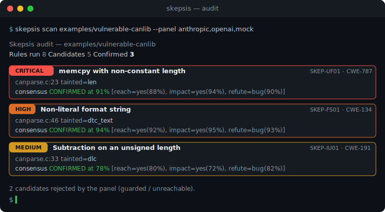

<div align="center">

# 🧐 Skepsis

### Hunt memory-safety bugs in C/C++ with a *panel of models* as your jury.

Skepsis finds the dangerous patterns, then makes three adversarial AI reviewers
**debate every one** and confirms the survivors with a **sanitizer** — so what
lands in your inbox is signal, not a wall of false positives.

[](https://github.com/0xTimi/skepsis/actions/workflows/ci.yml)
[](https://pypi.org/project/skepsis/)
[](https://pypi.org/project/skepsis/)
[](LICENSE)
[](https://github.com/astral-sh/ruff)
[](https://sarifweb.azurewebsites.net/)

[Quickstart](#-quickstart) · [How it works](#-how-it-works) · [Rules](#-what-it-looks-for) · [Config](#-configuration) · [Contributing](#-contributing)

</div>

---

## Why Skepsis?

Grep-style scanners drown you in false positives. Fuzzers are brilliant but blind
to code they can't reach and slow to stand up. Skepsis sits in between: a
**three-stage review** — find, debate, prove — packaged as a tool you can run in
one command.

> A single model asked to "find bugs" is happy to invent them.
> **Three models forced to argue** — one for reachability, one for impact, one
> whose only job is to *refute* the finding — drive the false-positive rate down.

- 🎯 **High-recall detection** of the bug classes that actually ship in protocol
  parsers: unbounded fields, integer underflows, format strings, check-after-use.
- ⚖️ **Multi-model consensus** — a configurable panel (Claude, GPT, or an offline
  mock) debates each candidate and votes with calibrated confidence.
- 🧪 **Sanitizer-backed proof** — confirm a bug with a 100%-crash-rate
  AddressSanitizer run before you believe it.
- 📤 **SARIF 2.1.0 output** drops straight into GitHub code scanning, or emit
  Markdown for PRs and a rich terminal report for humans.
- 🔌 **Zero-key demo** — the whole pipeline runs offline with the `mock` panel,
  so you can try it (and CI can test it) with nothing to configure.

## 🚀 Quickstart

```bash
pip install skepsis            # core + offline mock panel
# or, with real reviewers:
pip install 'skepsis[all]'     # anthropic + openai + tree-sitter
```

Scan the bundled vulnerable CAN library with the offline panel — no API key:

```bash
skepsis scan examples/vulnerable-canlib
```

<div align="center">

</div>

Bring real reviewers and emit SARIF for GitHub:

```bash
export ANTHROPIC_API_KEY=sk-...
export OPENAI_API_KEY=sk-...
skepsis scan src/ --panel anthropic,openai,anthropic --format sarif --out skepsis.sarif
```

Prove a specific bug is real with the sanitizer:

```bash
skepsis verify examples/vulnerable-canlib/poc_isotp_overflow.c --runs 20
# REPRODUCED  crash rate 100% (20/20 runs, sanitizer=address,undefined)
```

## 🧠 How it works

Skepsis is a three-stage pipeline — **find, debate, prove**:

```
        ┌─────────────┐      ┌──────────────────────┐      ┌────────────────┐
  src/ ─▶  Stage 1     │ cand │  Stage 2              │ conf │  Stage 3        │─▶ SARIF
        │  Scanner    ├─────▶│  Consensus panel     ├─────▶│  Sanitizer     │   Markdown
        │  (patterns) │      │  reach·impact·refute │      │  ASAN/UBSan    │   Console
        └─────────────┘      └──────────────────────┘      └────────────────┘
         high recall          false-positive killer         dynamic proof
```

1. **Stage 1 — Scanner.** Fast, dependency-free heuristics surface *candidate*
   sinks. Tuned for recall: a missed candidate can't be recovered later, but a
   false alarm is exactly what Stage 2 exists to reject.
2. **Stage 2 — Consensus panel.** Each candidate is examined by three roles.
   `reachability` asks whether attacker input can reach the sink; `impact` asks
   what happens if it does; `false-positive` is prompted to argue *against* the
   bug. Their opinions combine via a **geometric-mean vote**, so one confident
   dissenter can veto the group — the behaviour that suppresses false positives.
3. **Stage 3 — Sanitizer.** A proof-of-concept harness is compiled with
   `-fsanitize=address,undefined` and run N times. Skepsis's bar for a
   confirmed overflow is a **100% crash rate**; `skepsis verify` measures it.

See [docs/methodology.md](docs/methodology.md) for the full design and the exact
aggregation math.

## 🔎 What it looks for

| Rule | Class | CWE | Detects |
| --- | --- | --- | --- |
| `SKEP-UF01` | unbounded-field | CWE-787 | `memcpy` with a non-constant, protocol-derived length |
| `SKEP-UF02` | unbounded-field | CWE-120 | `strcpy` / `strcat` / `gets` / `sprintf` |
| `SKEP-UF03` | unbounded-field | CWE-770 | `alloca` / VLA sized by runtime input |
| `SKEP-IU01` | integer-underflow | CWE-191 | `len - N` on an unsigned length |
| `SKEP-IU02` | integer-underflow | CWE-125 | `buf[i - N]` index underflow |
| `SKEP-FS01` | format-string | CWE-134 | non-literal `printf`-family format argument |
| `SKEP-VO01` | verify-order | CWE-696 | length used before it is validated |
| `SKEP-UR01` | unchecked-return | CWE-252 | allocation result used without a NULL check |

Run `skepsis rules` for the live list.

## ⚙️ Configuration

Everything is settable via flags or `SKEPSIS_`-prefixed environment variables
(or a `.env` file):

| Setting | Env | Default | Meaning |
| --- | --- | --- | --- |
| panel | `SKEPSIS_PANEL` | `mock` | comma-separated provider ids |
| confirm threshold | `SKEPSIS_CONFIRM_THRESHOLD` | `0.6` | min consensus confidence to confirm |
| sanitizer runs | `SKEPSIS_SANITIZER_RUNS` | `20` | executions per verification |
| — | `ANTHROPIC_API_KEY` | — | enables the `anthropic` provider |
| — | `OPENAI_API_KEY` | — | enables the `openai` provider |

## 🧩 Use it as a library

```python
from skepsis import Skepsis, load_settings

engine = Skepsis(load_settings())
report = engine.audit("path/to/library")

for t in report.confirmed:
    print(t.finding.location, t.finding.title, t.verdict.confidence)
```

## 🗺️ Roadmap

- [ ] Tree-sitter backend for dataflow-aware candidate generation
- [ ] Automatic PoC-harness synthesis to close the loop on Stage 3
- [ ] AFL++/libFuzzer integration alongside sanitizers
- [ ] GitHub Action + pre-commit hook
- [ ] Rule packs for HTTP, TLS, and media-codec parsers

## 🤝 Contributing

Contributions are very welcome — new rules, providers, and reporters especially.
See [CONTRIBUTING.md](CONTRIBUTING.md) and our [Code of Conduct](CODE_OF_CONDUCT.md).
To report a security issue, read [SECURITY.md](SECURITY.md).

```bash
git clone https://github.com/0xTimi/skepsis && cd skepsis
python -m venv .venv && . .venv/bin/activate
pip install -e '.[dev]'
ruff check . && mypy src && pytest
```

## 📄 License

[Apache-2.0](LICENSE). Skepsis is a research and defensive-security tool; use it
only on code you are authorized to audit.

<div align="center">
<sub>Find, debate, prove. 🧐</sub>
</div>
